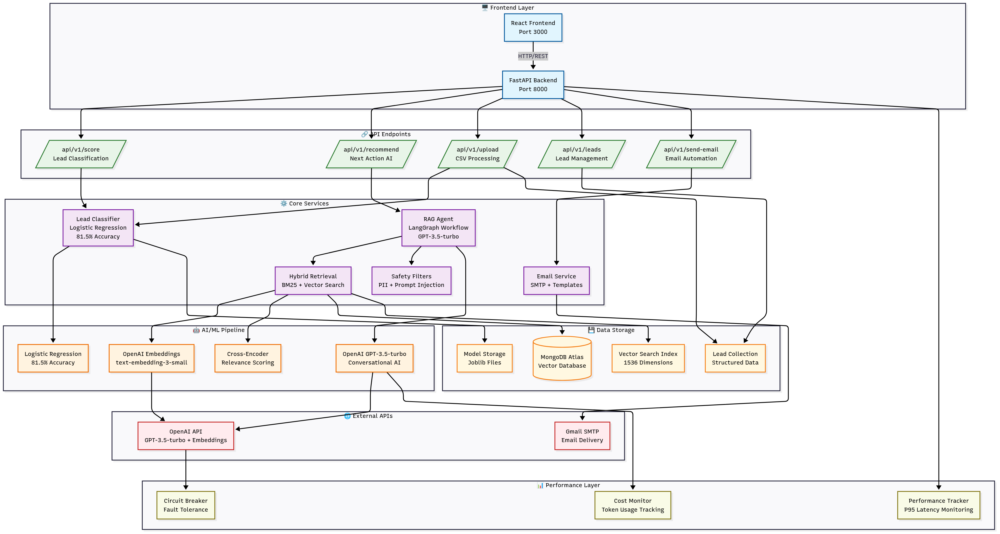

# 🎯 Lead HeatScore

> **AI-powered lead classification and personalized outreach platform** transforming sales intelligence with machine learning and RAG technology

## Key Features

- **Lead Classification**: Logistic Regression with XGBoost comparison
- **Personalized Recommendations**: RAG-powered next-action suggestions using LangGraph workflows
- **Hybrid Search**: BM25 + Vector similarity with cross-encoder reranking for superior relevance
- **Real-time Processing**: Sub-2-second response times with P95 latency monitoring
- **Enterprise Security**: Prompt injection detection and PII protection for production safety

## Architecture



*Modern microservices architecture enabling intelligent lead processing and personalized outreach automation*

## 🛠️ Tech Stack

**Backend Infrastructure**
- **FastAPI** (Python 3.10+) - Modern async web framework with automatic API documentation
- **Logistic Regression** - Lightweight production model achieving 81.5% classification accuracy
- **LangChain + LangGraph** - Advanced LLM orchestration and workflow automation
- **MongoDB Atlas** - Scalable vector database with semantic search capabilities
- **OpenAI GPT-3.5-turbo** - Cost-effective conversational AI for content generation

**Frontend Experience**
- **React 18** - Modern component-based UI with hooks and context
- **Tailwind CSS** - Utility-first styling for rapid development
- **Vite** - Lightning-fast build tool and development server
- **Lucide React** - Beautiful icons for intuitive user experience
- **React Hot Toast** - Elegant notifications for user feedback

## 📁 Project Structure

```
lead-heatscore/
├── backend/
│   ├── app/
│   │   ├── api/           # API endpoints
│   │   ├── models/        # Data schemas
│   │   ├── services/      # Business logic
│   │   └── utils/         # Utilities
│   ├── data/              # Training datasets
│   ├── models/            # Trained ML models
│   ├── metrics/           # Performance metrics
│   ├── scripts/           # Utility scripts
│   └── requirements.txt
├── frontend/
│   ├── src/
│   │   ├── components/    # React components
│   │   ├── pages/         # Page components
│   │   ├── contexts/      # React contexts
│   │   ├── lib/           # API client
│   │   └── utils/         # Frontend utilities
│   └── package.json
├── docs/                  # Documentation
├── notebooks/             # Jupyter notebooks
└── metrics/               # Performance analysis
```

## 🚀 Quick Start

### Prerequisites
- **Python 3.10+** - Modern Python runtime
- **Node.js 18+** - Latest LTS for frontend development
- **MongoDB Atlas** - Free cloud database account
- **OpenAI API Key** - Required for AI features (text-embedding-3-small + GPT-3.5-turbo)

### 🔧 Backend Setup

```bash
# Clone and setup
git clone <repository-url>
cd lead-heatscore

# Install Python dependencies
cd backend
pip install -r requirements.txt

# Configure environment variables
cp env.example .env
# Edit .env with MongoDB URI and OpenAI API key

# Start FastAPI server with hot reload
python -m uvicorn app.main:app --reload --port 8000
```

### 🎨 Frontend Setup

```bash
# Install Node.js dependencies
cd frontend
npm install

# Start React development server
npm run dev
```

**Access Points:**
- **Frontend**: http://localhost:3000
- **API Docs**: http://localhost:8000/docs (Interactive Swagger UI)
- **Health Check**: http://localhost:8000/health

## 🤖 AI & ML Pipeline

Leading the charge in **intelligent lead classification** with production-ready AI:

### Core Models
- **Logistic Regression** - 81.5% accuracy with optimized feature engineering
- **Vector Embeddings** - `text-embedding-3-small` (1536-dimensional semantic search)
- **LLM Generation** - `gpt-3.5-turbo` for cost-effective, high-quality content creation
- **LangGraph Workflows** - Orchestrated RAG processes for contextual recommendations

### Performance Highlights
- **Sub-2-second** response times on email generation
- **P95 latency < 2.5s** SLA compliance
- **Production-optimized** cost structure
- **Enterprise-grade** security and monitoring

> **🎯 Result**: Intelligent, scalable AI system delivering personalized lead insights at scale

## MongoDB Atlas Setup

1. Create MongoDB Atlas account at [mongodb.com/atlas](https://mongodb.com/atlas)
2. Create new cluster (M0 free tier available)
3. Create database user with read/write permissions
4. Whitelist your IP address
5. Get connection string and add to `.env` file
6. Create vector search index for embeddings


